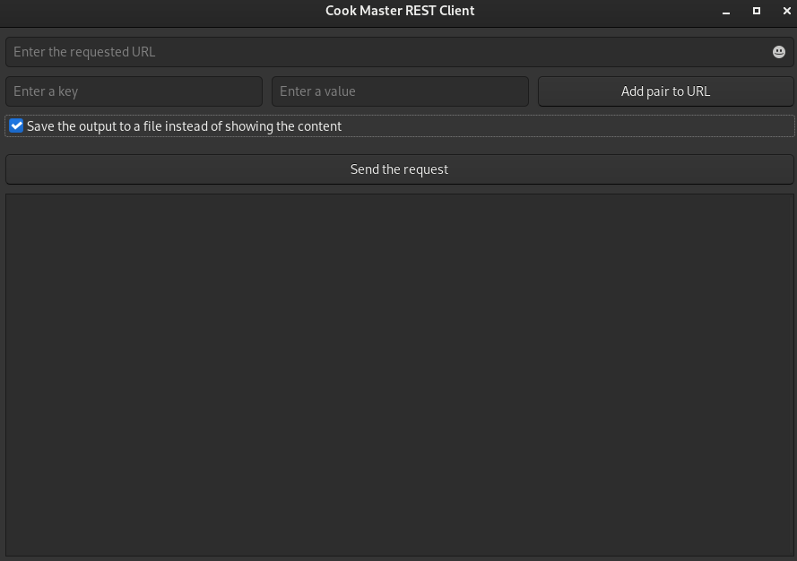
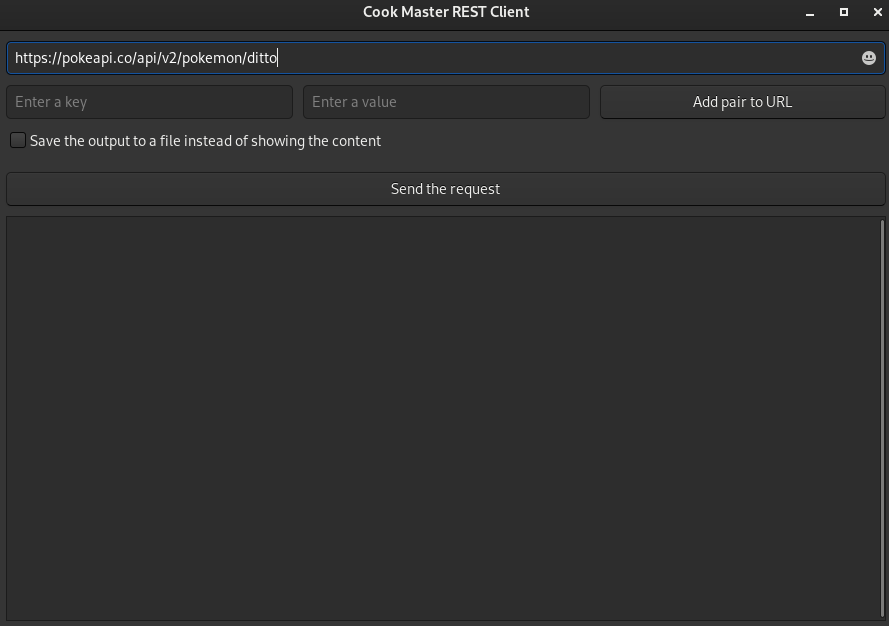
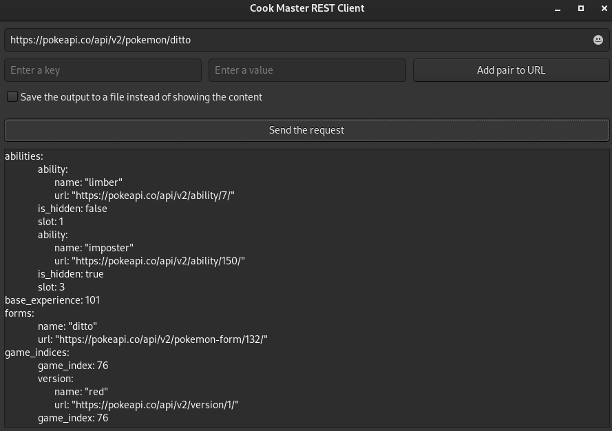
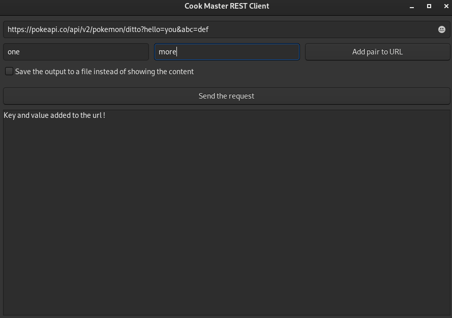
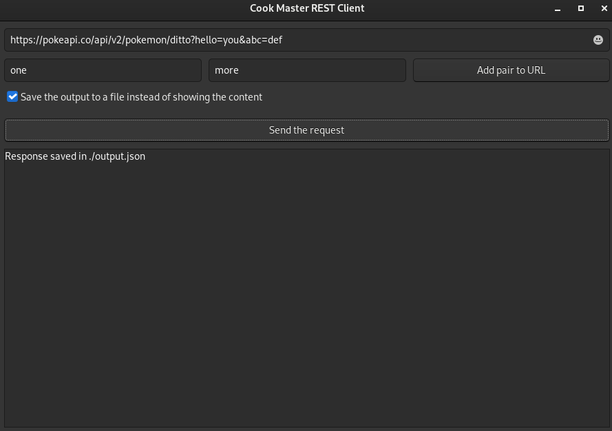

# Cook Master REST Client

- [Cook Master REST Client](#cook-master-rest-client)
  - [Description](#description)
  - [Installation](#installation)
  - [Usage](#usage)
    - [Create a new request](#create-a-new-request)
    - [Add parameters](#add-parameters)
    - [Save the output to a file](#save-the-output-to-a-file)
  - [End](#end)


## Description

This is a project that we made for the ESGI's annual project. 

It's a REST Client that allow you to request any API you want.


## Installation

The installation is pretty straightforward, you just need to clone the project and run the following command:

```bash
make install_ubuntu # If you are on Ubuntu
make install_fedora # If you are on Fedora
make && ./prog # To launch the application
```

As we use GTK3, there is no uninstall command, as GTK is used by other applications on your OS.

## Usage

First of all, let's take a look of what the application looks like:



Pretty neat right? Now let's see how to use it.

### Create a new request

To create a request, first of all you need to add the URL of the API you want to request.



Basically, if the API doesn't require any parameters, you can send the request, and response will then show in the area below.



### Add parameters

If the API you want to request requires parameters, you can add them by adding value in the key and value are, then by clicking on the "Add pair to URL" button.



### Save the output to a file

If you want to save the output of your request to a file, you can do it by clicking on the "Save to file" button.
It won't show the response in the response area, but it will save it to a file.



## End

That's it, you now know how to use our application, we hope you'll enjoy it.

